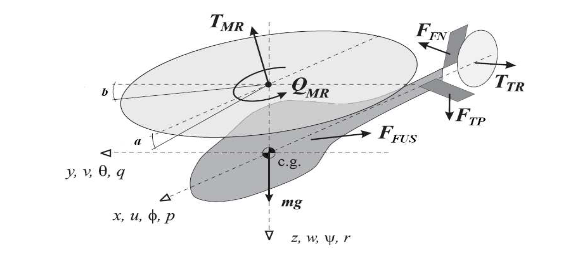{width="5.511811023622047in"
height="1.3978510498687664in"}

SCUOLA POLITECNICA E DELLE SCIENZE DI BASE

**EXAM PAPER OF**

**COMPLEMENTS OF CONTROLS**

Controlling a helicopter

+-----------------------------------------------------------------------+
| Candidate                                                             |
+=======================================================================+
| MARIO VALENTINO                                                       |
|                                                                       |
| P38000205                                                             |
+-----------------------------------------------------------------------+

Academic Year 2022/2023

Sommario

[Introduction [3](#introduction)](#introduction)

[Model [5](#model)](#model)

[Assigning eigenvalues
[6](#assigning-eigenvalues)](#assigning-eigenvalues)

[Integral action [7](#integral-action)](#integral-action)

[Observer [8](#observer)](#observer)

[Results [8](#results)](#results)

[Mixed Sensitivity Design
[12](#mixed-sensitivity-design)](#mixed-sensitivity-design)

[Choice of Wt [12](#choice-of-wt)](#choice-of-wt)

[Choice of Ws and Wk [14](#choice-of-ws-and-wk)](#choice-of-ws-and-wk)

[Results [15](#results-1)](#results-1)

[LQ Control [19](#lq-control)](#lq-control)

[Kalman filter [21](#kalman-filter)](#kalman-filter)

[Appendix [24](#appendix)](#appendix)

# Introduction

The aim of the paper is the application of three different design
techniques for the hovering control of a Yamaha R-MAX helicopter. The
Yamaha R-MAX is a gasoline-powered UAV, controlled in line of sight by
the user via a remote control. It was designed primarily to be used in
agriculture.

The mathematical model of a helicopter is clearly non-linear and the
equations to be used change according to the flight regime. In this
paper we will focus on low-speed flight, whose model can be linearized
and, with the appropriate simplifications, reduced to a system of order
13.

The control quantities are:

1.  **Lateral Cyclic**: allows you to tilt the main rotor so as to move
    the thrust vector sideways allowing the helicopter to move in that
    direction.

2.  **Longitudinal Cyclic**: like the lateral cyclic, it allows you to
    move longitudinally.

3.  **Rudder**: allows you to control the direction in which the nose of
    the helicopter is pointing. The rudder works by changing the angle
    of incidence of the tail rotor, increasing or decreasing its thrust
    in the desired direction.

4.  **Collective pitch**: allows you to vary the angle of incidence of
    the main rotor blades at the same time. By increasing the collective
    pitch, the vertical thrust is increased and the helicopter rises,
    while decreasing it reduces the thrust and the helicopter descends.

The control quantities vary between -1 and 1 (dimensionless). The
validity regime of the model is such that if the control works well, the
control quantities should always remain far from the limit values. In
the Simulink simulation schemes, however, saturation blocks that
simulate the physical limit of the actuators have been inserted.

The settling time should be about 5 seconds. Overelongation should be
low (maximum 15-20%). In this context, a lower overelongation is
preferable even if this leads to a slight increase in settling time.

The outputs of the model are the three translational speeds **u, v** and
w**, and the rotation speed about the vertical axis** yaw rate measured
by the gyroscopic yaw rate sensor.

{width="3.5416666666666665in"
height="1.6041666666666667in"}

Figure 1: System Description

Matrix A:

  ----------------------------------------------------------------------------------------------------------
  -0.051   0        0      0       0     -322   -322     0        0        0       0       0        -0.051
  -------- -------- ------ ------- ----- ------ -------- -------- -------- ------- ------- -------- --------
  0        -0.154   0      0       322   0      0        322      0        0       0       0        0

  -0.144   0.143    0      0       0     0      0        166      0        0       0       0        -0.144

  -0.056   -0.057   0      0       0     0      82.6     0        0        0       0       0        -0.056

  0        0        1      0       0     0      0        0        0        0       0       0        0

  0        0        0      1       0     0      0        0        0        0       0       0        0

  0        0        0      -1      0     0      -21.74   -4.109   0        0       0       14       0

  0        0        -1     0       0     0      8        -21.74   0        0       0       0        0

  0        0        0      0       0     0      -9.75    -131     -0.614   0.93    0       0        0

  0        0        0.03   -3.53   0     0      0        0        0        0.086   -4.23   -33.1    0

  0        0        0      0       0     0      0        0        0        21.16   -8.26   0        0

  0        0        0      -1      0     0      0        0        0        0       0       -2.924   0

  0        0        1      0       0     0      0        0        0        0       0       0        0
  ----------------------------------------------------------------------------------------------------------

Matrix B:

  ------------------------------------------------------------------------
  0                  0                   0               0
  ------------------ ------------------- --------------- -----------------
  0                  0                   0               0

  0                  0                   0               0

  0                  0                   0               0

  0                  0                   0               0

  0                  0                   0               0

  0.68               -2.174              0               0

  3.043              0.3                 0               0

  0                  0                   0               -45.8

  0                  0                   33.1            -3.33

  0                  0                   0               0

  0                  -0.757              0               0

  0.798              0                   0               0
  ------------------------------------------------------------------------

Matrix C:

  -----------------------------------------------------------------------------
  1     0     0     0     0     0     0     0     0     0     0     0     0
  ----- ----- ----- ----- ----- ----- ----- ----- ----- ----- ----- ----- -----
  0     1     0     0     0     0     0     0     0     0     0     0     0

  0     0     0     0     0     0     0     0     1     0     0     0     0

  0     0     0     0     0     0     0     0     0     0     1     0     0
  -----------------------------------------------------------------------------

The state variables are respectively: **u, v, roll rate, pitch rate,
roll, pitch, flapping angle a, flapping angle b ,w ,yaw rate, gyroscope
yaw rate, paddle angle c, paddle angle d**. All quantities are expressed
in the units of measurement of the International System.

## Model 

clear all

load(\'Elicottero.mat\')

states = {\'u\',\'v\',\'roll rate\',\'pitch
rate\',\'roll\',\'pitch\',\'flapping a\',\'flapping b\',\'w\',\'yaw
rate\',\'gyroscope yaw rate\',\'paddle c\', \'paddle d\'};

inputs = {\'Lateral cyclic \[-1, 1\]\', \'Longitudinal cyclic \[-1,
1\]\', \'Rudder \[-1, 1\]\', \'Collective pitch \[-1, 1\]\'};

outputs = {\'u\', \'v\', \'w\',\'gyroscope yaw rate\'};

C = zeros(4,13);

C(1,strcmp(states, \'u\')) = 1;

C(2,strcmp(states, \'v\')) = 1;

C(3,strcmp(states, \'w\')) = 1;

C(4,strcmp(states, \'gyroscope yaw rate\')) = 1;

D = zeros(4,4);

sys = ss(A,B,C,D);

s = tf(\'s\');

%matrice di trasferimento

G = tf(sys);

%bode(G), figure, step(G)

First you need to check the controllability and observability properties
of the system. Since the elements of the controllability and
observability matrix span a very large range (some elements are less
than one, others are greater than $10^{12}$)), the default tolerance
used by Matlab leads to incorrect conclusions. By specifying an
appropriate tolerance we see that the system is completely controllable
and completely observable.

Ctr = ctrb(A,B); r_ctr = rank(Ctr,1e-6)

r_ctr = 13

Obs = obsv(A,C); r_obs = rank(Obs,1e-6)

r_obs = 13

# Assigning eigenvalues

The first design technique consists in assigning eigenvalues. Six poles
of the system are chosen with the ITAE method: given a pulsation are the
poles that minimize $\int_{0}^{+ \infty}{t|e(t)|dt}$ that guarantee few
oscillations with a relatively small overelongation. The pulsation is
chosen by trial and error on the basis of the desired settling time. The
remaining poles must be chosen not too far to the left to avoid too much
or too nervous control, not too close to the poles assigned with itae so
as not to make them lose dominance. A good trade-off was found by taking
them real and spacing them respectively by one to the
left.$\omega_{n}\omega_{n}$

omega_n_itae = 1.7;

p_itae = itae(6,omega_n_itae);

for i=7:13

p_itae = \[p_itae real(p_itae(i-1))-1\];

end

Assigned poles:

disp(p_itae\')

-0.5268 + 2.1477i

-0.5268 - 2.1477i

-0.9869 + 1.3308i

-0.9869 - 1.3308i

-1.2489 + 0.4883i

-1.2489 - 0.4883i

-2.2489 + 0.0000i

-3.2489 + 0.0000i

-4.2489 + 0.0000i

-5.2489 + 0.0000i

-6.2489 + 0.0000i

-7.2489 + 0.0000i

-8.2489 + 0.0000i

K_itae = place(A,B,p_itae);

CC_itae = ss(A-B\*K_itae,B,C,D);

step(CC_itae), dcgain(CC_itae)

> 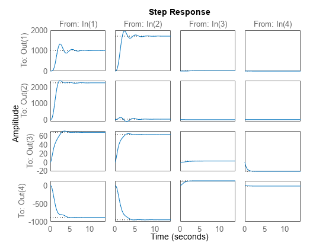{width="4.375in"
> height="3.28125in"}

Figure 2: System Step Response with Status Feedback

ans = 4×4

10^3^ ×

1.0043 1.7099 0.0187 -0.0026

2.2615 0.0263 -0.0043 0.0004

0.0681 0.0631 0.0027 -0.0207

-0.8790 -0.9459 0.1326 -0.0124

## Integral action

Obviously, the assignment of eigenvalues by state feedback does not
allow by itself to obtain error at zero speed. To ensure this
specification it is necessary to introduce 4 supplements that integrate
the error of the output with respect to the reference. We therefore
consider the increased system that must be completely controllable:

Aint = \[A zeros(13,4);

-C zeros(4,4)\];

Bint = \[B; -D\];

Cint = \[C, zeros(4,4)\];

Dint = D;

Ctr_int = ctrb(Aint,Bint); r_ctr_int = rank(Ctr_int,1e-6)

r_ctr_int = 17

The controllability matrix has full rank, so the answer is yes. At this
point it is necessary to assign the 17 poles of the augmented system.
The first 13 are those chosen previously, the following are chosen
through the same considerations made before.

p_int = \[p_itae\';

p_itae(end)-0.5;

p_itae(end)-1;

p_itae(end)-1.5;

p_itae(end)-2\];

K_int = place(Aint,Bint,p_int);

The K obtained with the place command consists of 17 elements. As the
augmented implant matrices were constructed, the first 13 elements are
related to the state feedback, the last 4 are the multiplicative
constants of the supplements.

K_s = K_int(:,1:13);

K_i = K_int(:,14:17);

## Observer

For the principle of separation it is possible to design the observer
directly. The poles of the observer must be chosen sufficiently to the
left to allow rapid convergence of the estimation error, remembering,
however, that an observer who is too fast increases the bandwidth of the
system by amplifying the measurement noise.

p_obs = real(p_itae)-10;

L = place(A\',C\',p_obs)\';

Aobs = (A-L\*C);

Bobs = \[B - L\*D, L\];

Cobs = eye(13);

Dobs = zeros(13,8);

## Results

To verify the functioning of the state feedback with integral action,
the initial condition of the observer is equal to the initial condition
of the system. In this way it is as if the observer were not there.

The graphs show the response to a reference of $1\ m/s$ along x and,
after three seconds, also a reference of $0.5\ m/s\ $ along the vertical
direction. Basically, the helicopter is being asked to move forward and
simultaneously climb after three seconds, keeping the lateral and
rotational speeds around the vertical axis null.

x0_obs = 0;

eig_out = sim(\'autovalori_sim.slx\');

plotyu(eig_out,\'ulim\',\[-0.05,0.05\],\'ylegend\',outputs,\'ulegend\',inputs)

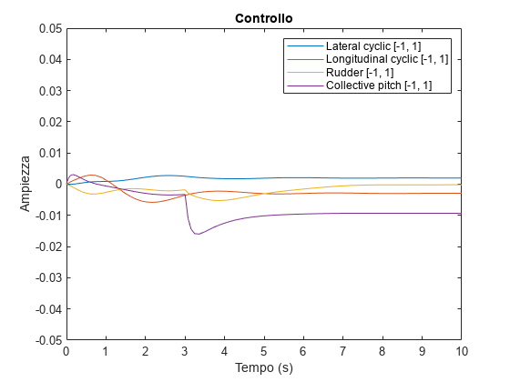{width="4.373611111111111in"
height="3.2784722222222222in"}

Figure 3: Control action corresponding to the simulation with eigenvalue
assignment and integral action

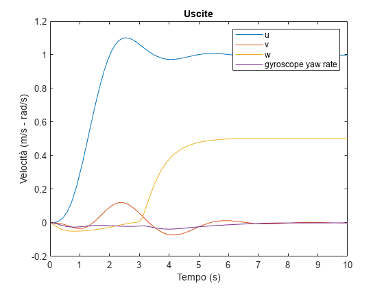{width="4.373611111111111in"
height="3.2784722222222222in"}

Figure 4: Eigenvalue assignment simulation output and integral action

To verify the operation of the observer, the simulation can be repeated
starting from an initial state different from that of the system. For
the sole purpose of displaying the prediction error, an identity matrix
has been added to the process\'s C matrix that displays its status.

x0_obs = rand(13,1)\*0.005-0.0025;

eig_out_obs = sim(\'autovalori_sim.slx\');

plotyu(eig_out_obs,\'ulim\',\[-0.05,0.05\],\'ylegend\',outputs,\'ulegend\',inputs,\'un\',1:4,\'yn\',1:4)

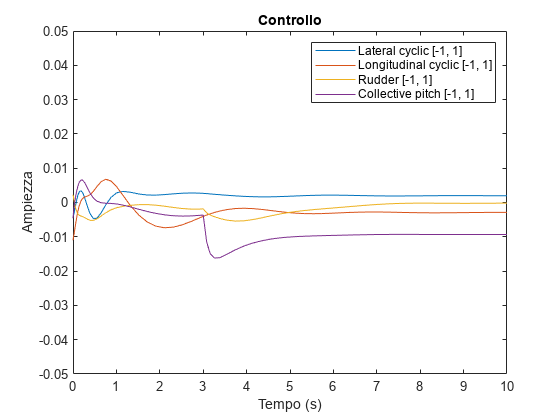{width="4.37129593175853in"
height="3.2784722222222222in"}

Figure 5: Control action with observer

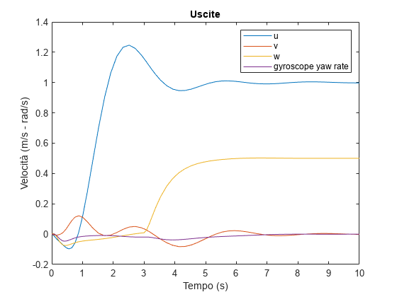{width="4.37129593175853in"
height="3.2784722222222222in"}

Figure 6: Simulation output with observer

plot(eig_out_obs.e.time,eig_out_obs.e.signals.values);

title(\'Errore di stima\')

xlabel(\'Tempo (s)\')

xlim(\[0 5\])

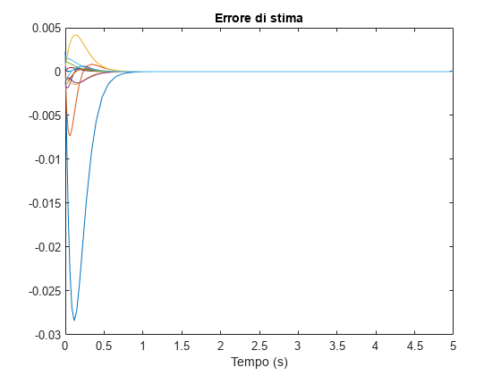{width="4.37129593175853in"
height="3.2784722222222222in"}

Figure 7: Error between observed state and actual state

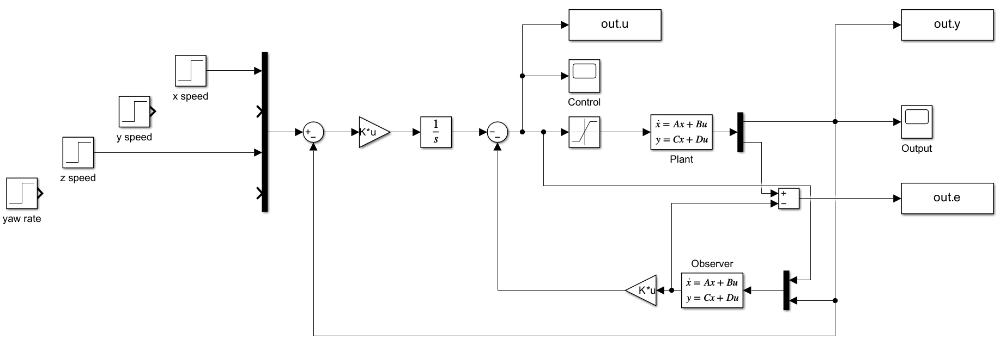{width="6.7148239282589675in"
height="2.3663506124234472in"}

Figure 8: Final control scheme assigning eigenvalues

# Mixed Sensitivity Design

The Mixed Sensitivity Design technique also allows robustness
specifications to be taken into account. The implant is assumed to be
affected by multiplicative uncertainty:
{width="0.875in" height="0.1875in"} where
{width="2.557292213473316in"
height="1.21875in"}: The actual plant has an output uncertainty on each
channel which, in the worst case, is
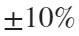{width="0.4114588801399825in" height="0.1875in"}
on the gain and a time delay of
{width="0.4010422134733158in"
height="0.1875in"}.

The **mixsyn** command searches for the regulator
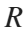{width="0.13541666666666666in"
height="0.1875in"} which minimizes the norm
{width="0.24479221347331584in"
height="0.1875in"} of the matrix
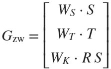{width="1.1614588801399826in"
height="0.71875in"} where
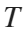{width="0.13541666666666666in"
height="0.1875in"} and
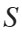{width="0.11458333333333333in"
height="0.1875in"} are the complementary and direct sensitivity
functions, respectively. Matrices
{width="0.8333333333333334in" height="0.1875in"}
are weight matrices that allow you to choose in which band to go to
minimize the matrix that they multiply.

## Choice of Wt

Let 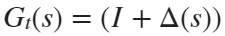{width="1.171875546806649in"
height="0.1875in"} it is shown, applying the small gain theorem, that
the system is robust if
{width="1.0208333333333333in"
height="0.1875in"}. The weight matrix
{width="0.23437554680664918in"
height="0.1875in"} must be greater than
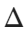{width="0.14583333333333334in"
height="0.1875in"} for all frequencies. Since this is generally a very
restrictive sufficient condition, small frequency bands are tolerated in
which the mark-up is not perfect.

delay = 0.01;

Gt = ss(\[\],\[\],\[\],diag(\[1.1 1.1 1.1 1.1\]));

Gt.OutputDelay=delay\*ones(1,4);

Greal = Gt\*sys;

bode(G(1,1),Greal(1,1))

legend(\"G(1,1)\",\"Greal(1,1)\")

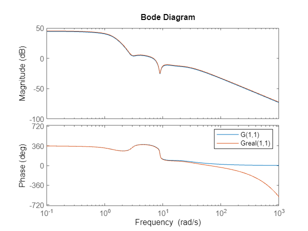{width="4.373611111111111in"
height="3.2784722222222222in"}

Figure 9: Nominal and real process bode diagrams (first input-output
channel only)

Delta=(eye(4)-Gt);

WT = (1 - 1.1\*(1-s\*delay/2)/(1+s\*delay/2)).\*eye(4);

sigma(WT,Delta)

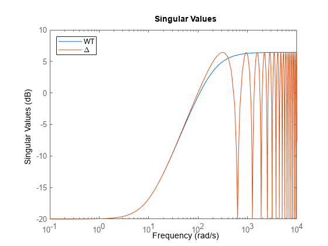{width="4.37129593175853in"
height="3.2784722222222222in"}

Figure 10: Uncertainties and weight matrix

## Choice of Ws and Wk

Matrices $W_{S}$ and $W_{K}$ are chosen by trial and error. The weight
matrix of direct sensitivity is chosen large where we want
{width="0.13541666666666666in"
height="0.1875in"} large, that is, in the desired bandwidth. To have
tracking of the step reference, very low frequency poles are placed that
force the presence of an integrator in the ring function.

WS = tf(zeros(4));

WS(1,1) = 1e4/(1+s/1e-4);

WS(2,2) = 1e4/(1+s/1e-3);

WS(3,3) = 1e4/(1+s/1e-5);

WS(4,4) = 1e4/(1+s/1e-5);

sigma(WT,WS)

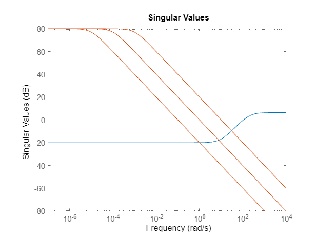{width="4.373611111111111in"
height="3.2784722222222222in"}

Figure 11: Choosing WS Weight Matrices (in red)

The matrix {width="0.24479221347331584in"
height="0.1875in"} It is used to weigh the control action: it must be
increased to reduce the control amplitude, being careful to comply with
other specifications, including that on robustness. Constant 0.5 was
taken on each channel. To further improve control in the initial
moments, it was decided to filter the speed references $u,\ v\ e\ w$
through appropriate first order filters.

WK = tf(1e0.\*diag(\[1 1 1 1\]).\*0.5);

\[K_inf,CL,GAM,INFO\] = mixsyn(sys,WS,WK,WT);

## Results

out_hinf = sim(\'H_inf_sim.slx\');

plotyu(out_hinf,\'ulim\',

\[-0.05,0.05\],\'ylegend\',outputs,\'ulegend\',inputs,\'un\',1:4,\'yn\',1:4)

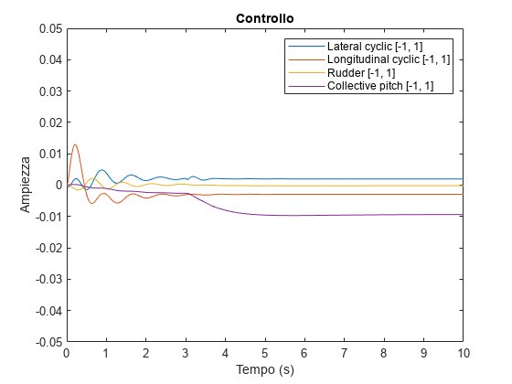{width="4.37129593175853in"
height="3.2784722222222222in"}

Figure 12: Control action with mixsyn

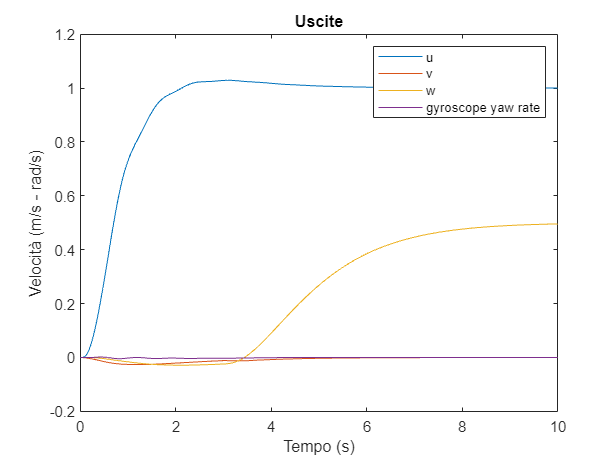{width="4.37129593175853in"
height="3.2784722222222222in"}

Figure 13: Controller simulation obtained with mixsyn

The specifications are largely respected with greater decoupling between
channels than the design with assignment of eigenvalues.

L = G\*K_inf;

S = feedback(eye(4),L);

T = feedback(L,eye(4));

sigma(T,S)

legend(\'T\',\'S\')

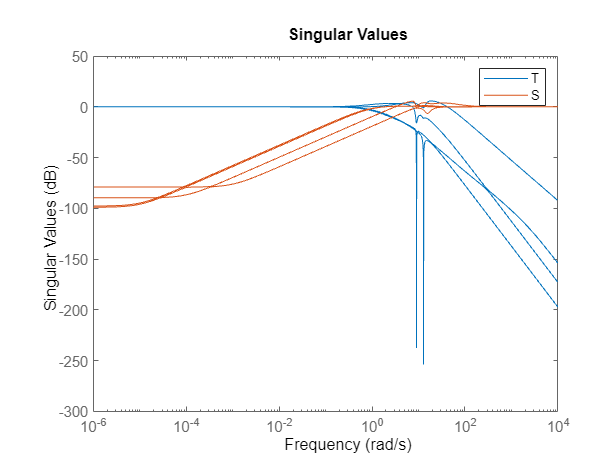{width="4.373611111111111in"
height="3.2784722222222222in"}

Figure 14: Diagram of singular values of direct and complementary
sensitivity functions

In addition, the singular values of
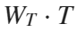{width="0.4479166666666667in" height="0.1875in"}
are always below the axis
{width="0.2656255468066492in"
height="0.1875in"}, so the system is robust. This is confirmed in the
simulation on the real system.

sigma(WT\*T),grid

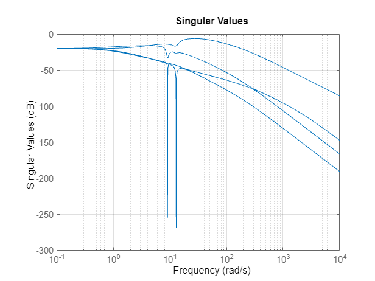{width="4.373611111111111in"
height="3.2784722222222222in"}

Figure 15: Robustness check

plotyu(out_hinf,\'ulim\',

\[-0.05,0.05\],\'ylegend\',outputs,\'ulegend\',inputs,\'un\',5:8,\'yn\',5:8)

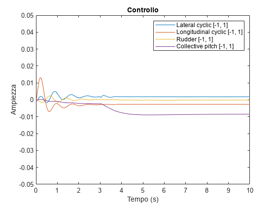{width="4.37129593175853in"
height="3.2784722222222222in"}

Figure 16: Control quantity action with the designed regulator, applied
to the uncertain plant

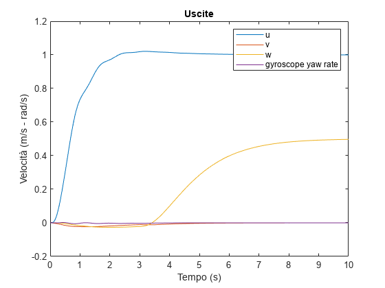{width="4.37129593175853in"
height="3.2784722222222222in"}

Figure 17: Simulation of the uncertain plant output

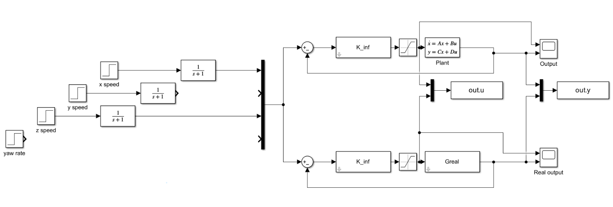{width="6.828358486439195in"
height="2.316360454943132in"}

Figure 18: Complete simulink diagram with mixsyn

# LQ Control

The optimal LQ control consists of finding the
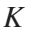{width="0.15104221347331584in"
height="0.1875in"} state feedback matrix that minimizes the objective
function 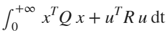{width="1.4322922134733158in"
height="0.3020833333333333in"}. The matrices
{width="0.14583333333333334in"
height="0.1875in"} and
{width="0.13541666666666666in"
height="0.1875in"} penalize respectively high values of the state and
control inputs. The values are chosen by trial and error until the
output with the desired characteristics is obtained. Since you want a
null error on the speed, the **lqr command** is executed on the matrices
of the augmented system, with the presence of 4 integrators.

Q = diag(\[1; 1; 1; 1; 1; 1; 1; 1; 1; 1; 1; 1; 1; 0.3; 0.3; 0.3;
0.3\]).\*1;

R = diag(\[1; 4; 1; 1\]).\*5;

\[K_lq, S, eig_LQ\] = lqr(Aint, Bint,Q,R);

K_s_lq = K_lq(:,1:13);

K_i_lq = K_lq(:,14:17);

out_lq = sim(\'LQR_sim\');

plotyu(out_lq,\'ulim\',\[-0.05,0.05\],\'ylegend\',outputs,\'ulegend\',inputs)

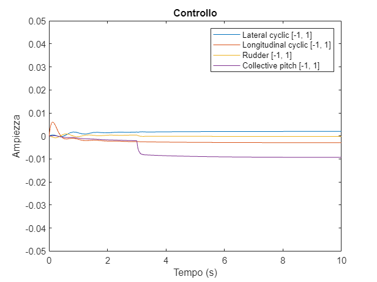{width="4.373611111111111in"
height="3.2784722222222222in"}

Figure 19: Control magnitude of the controller designed with the LQ
control

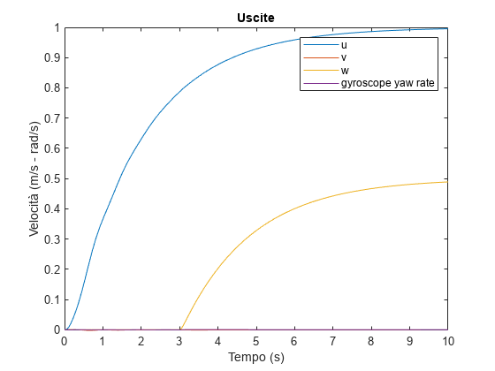{width="4.373611111111111in"
height="3.2784722222222222in"}

Figure 20: Simulation with LQ Control

With this choice of weight matrices, it is possible to obtain a response
that, with a slightly longer settling time, does not present
overelongation. At the same time, the control quantities are very low
and the channels are strongly decoupled. Given the context, such an
output is very desirable despite the settling time slightly exceeding
the specification.

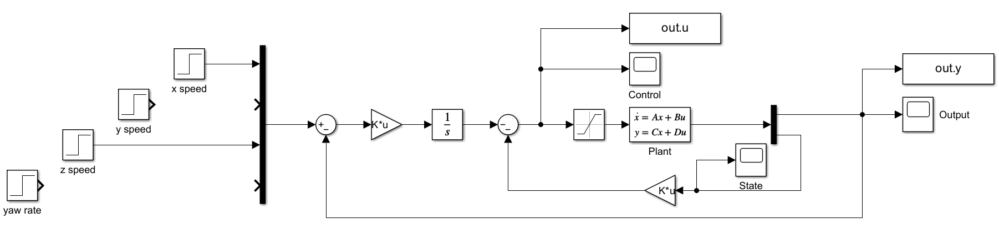{width="6.638081802274716in"
height="1.545550087489064in"}

Figure 21: Complete diagram of state feedback with K obtained through
the LQ control

# Kalman filter

To maintain the optimality of the solution by inserting an observer it
is necessary to use a Kalman filter, which is also useful to minimize
the variance of the estimation error in the event that there are process
or output measurement noises. By the principle of separation, the
observer\'s design can be carried out once the state feedback design is
completed. In particular, it is sufficient to solve the LQ problem to
the dual system by obtaining the observer matrix
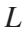{width="0.13541666666666666in"
height="0.1875in"} . Again, the initial conditions of the observer and
the system are different.

BandWidth=500;

NoisePower=1e-6/BandWidth;

Rt=eye(4)\*NoisePower;

Qt=eye(13)\*1e-10;

L_kalman = lqr(A\',C\',Qt,Rt)\';

A_k = (A-L_kalman\*C);

B_k = \[B - L_kalman\*D, L_kalman\];

C_k = eye(13);

D_k = zeros(13,8);

x0_obs = rand(13,1)\*0.005-0.0025;

out_lqg = sim(\'LQG_sim\');

plotyu(out_lqg,\'ulim\',\[-0.05,0.05\],\'ylegend\',outputs,\'ulegend\',inputs)

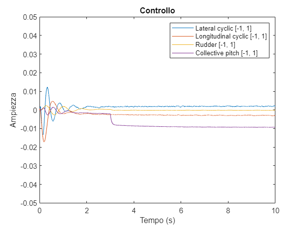{width="4.373611111111111in"
height="3.2784722222222222in"}

Figure 22: Kalman filter system control magnitude in the presence of
process and output noise

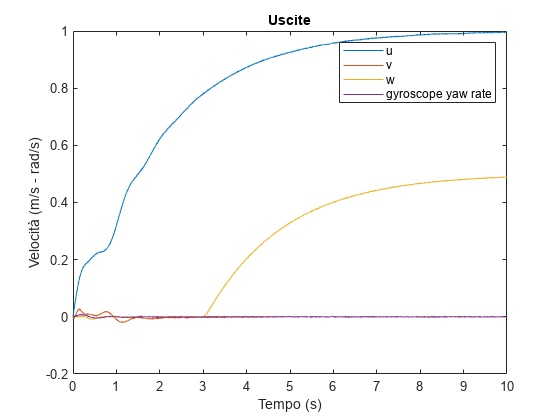{width="4.373611111111111in"
height="3.2784722222222222in"}

Figure 23: Kalman filter system output

The specifications are still met, the initial transient has a more
oscillatory character due to the initial estimation error.

plot(out_lqg.e.time,out_lqg.e.signals.values);

title(\'Errore di stima\')

xlabel(\'Tempo (s)\')

xlim(\[0 5\])

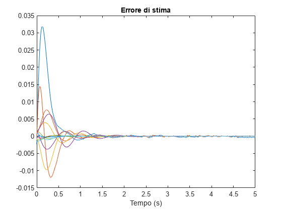{width="4.375in"
height="3.28125in"}

Figure 24: Estimation error between observed and actual state

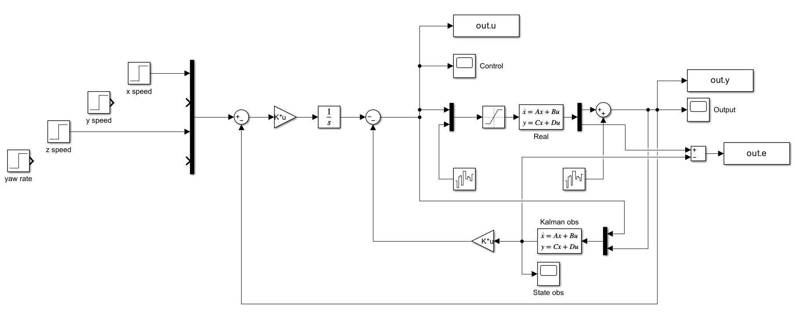{width="6.5in" height="2.6215277777777777in"}

Figure 25: Complete diagram of the LQG control

# Appendix

A Matlab function called \"plotyu\" was created to avoid the repetition
of the code needed to generate the control magnitude and output graphs.
This feature is designed to print all charts in a standard format.

The \"plotyu\" function requests as an argument the object returned by
the Matlab \"sim\" command and allows the use of optional parameters to
specify the limits of the axes relative to the control quantity \"u\"
and the output quantity \"y\" or a legend.

Using the \"plotyu\" function greatly reduces the amount of code
required to generate control magnitude and output graphs, making it
easier to display data consistently and consistently, and increasing
code readability.

function plotyu(out,varargin)

p = inputParser;

addParameter(p, \'ulim\', \[-1 1\]);

addParameter(p, \'ylim\', 0);

addParameter(p,\'ulegend\',{});

addParameter(p,\'ylegend\',{});

addParameter(p,\'un\',0);

addParameter(p,\'yn\',0);

parse(p, varargin{:});

ulim = p.Results.ulim;

ylim = p.Results.ylim;

ulegend = p.Results.ulegend;

ylegend = p.Results.ylegend;

un = p.Results.un;

yn = p.Results.yn;

figure

if un\~=0

plot(out.u.time, out.u.signals.values(:,un));

else

plot(out.u.time, out.u.signals.values);

end

title(\'Controllo\');

xlabel(\'Tempo (s)\');

ylabel(\'Ampiezza\');

axis(\[out.u.time(1) out.u.time(end) ulim\])

if isempty(ulegend) \~= 1

legend(ulegend);

end

figure

if un\~=0

plot(out.y.time, out.y.signals.values(:,yn));

else

plot(out.y.time, out.y.signals.values);

end

title(\'Uscite\');

xlabel(\'Tempo (s)\');

ylabel(\'Velocità (m/s - rad/s)\');

if isempty(ylegend) \~= 1

legend(ylegend);

end

if ylim \~= 0

axis(\[out.y.time(1) out.y.time(end) ylim\])

end

end

For the model, reference was made to Model Helicopter Control, Tiago D.
T. Rita - IDMEC/IST, Universidade Técnica de Lisboa (TU Lisbon)
available at the link
<https://fenix.tecnico.ulisboa.pt/downloadFile/395139413911/resumo.pdf>.
